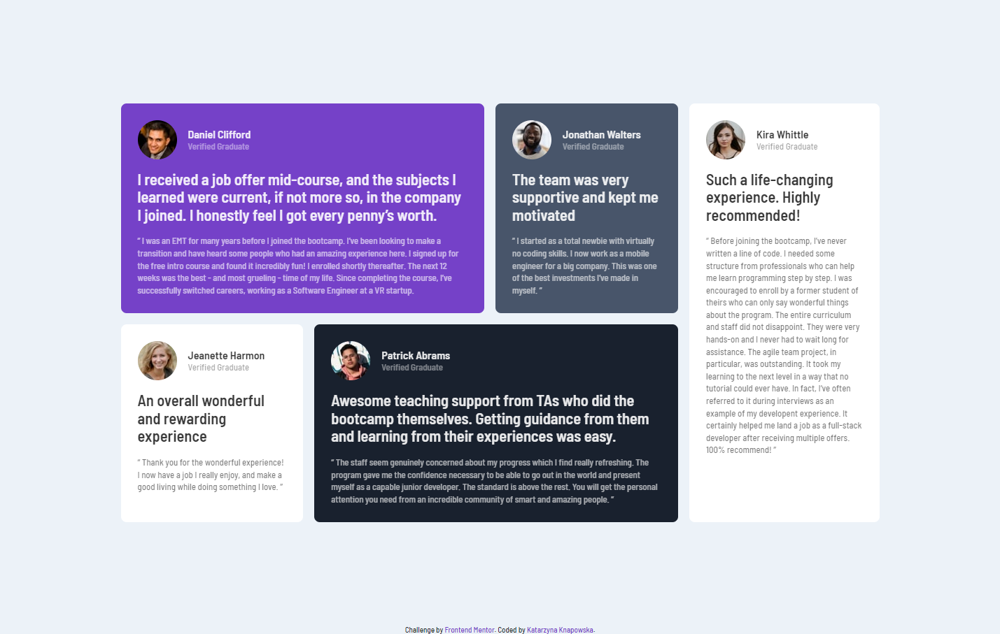

# Testimonials grid section solution (Frontend Mentor challenge)

This is a solution to the [Testimonials grid section challenge on Frontend Mentor](https://www.frontendmentor.io/challenges/testimonials-grid-section-Nnw6J7Un7). Frontend Mentor challenges help you improve your coding skills by building realistic projects. 

In this project users are able to view the optimal layout for the site depending on their device's screen size.

### Built with

- HTML5
- SCSS
- GRID
- RWD

### Screenshot

#### Author: Katarzyna Knapowska